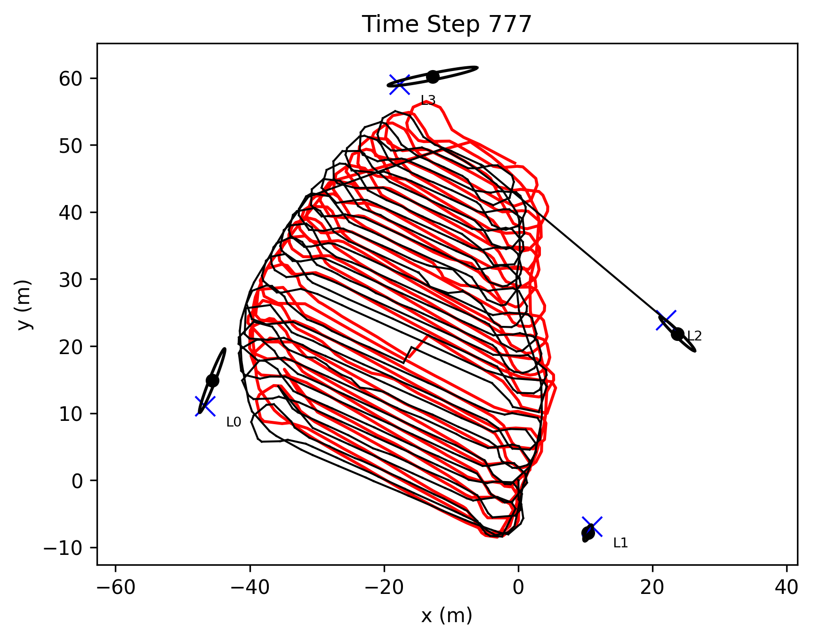
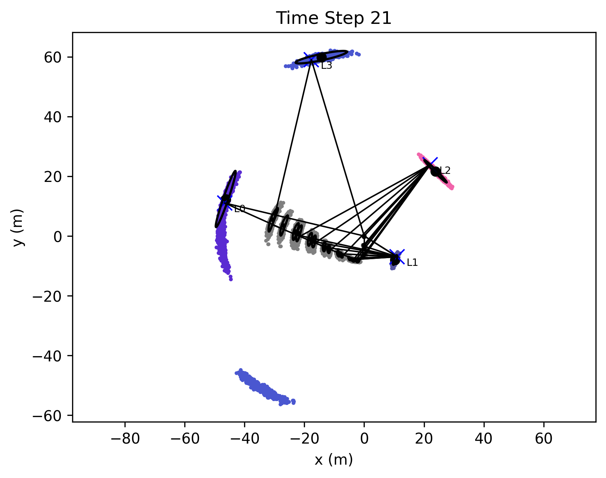
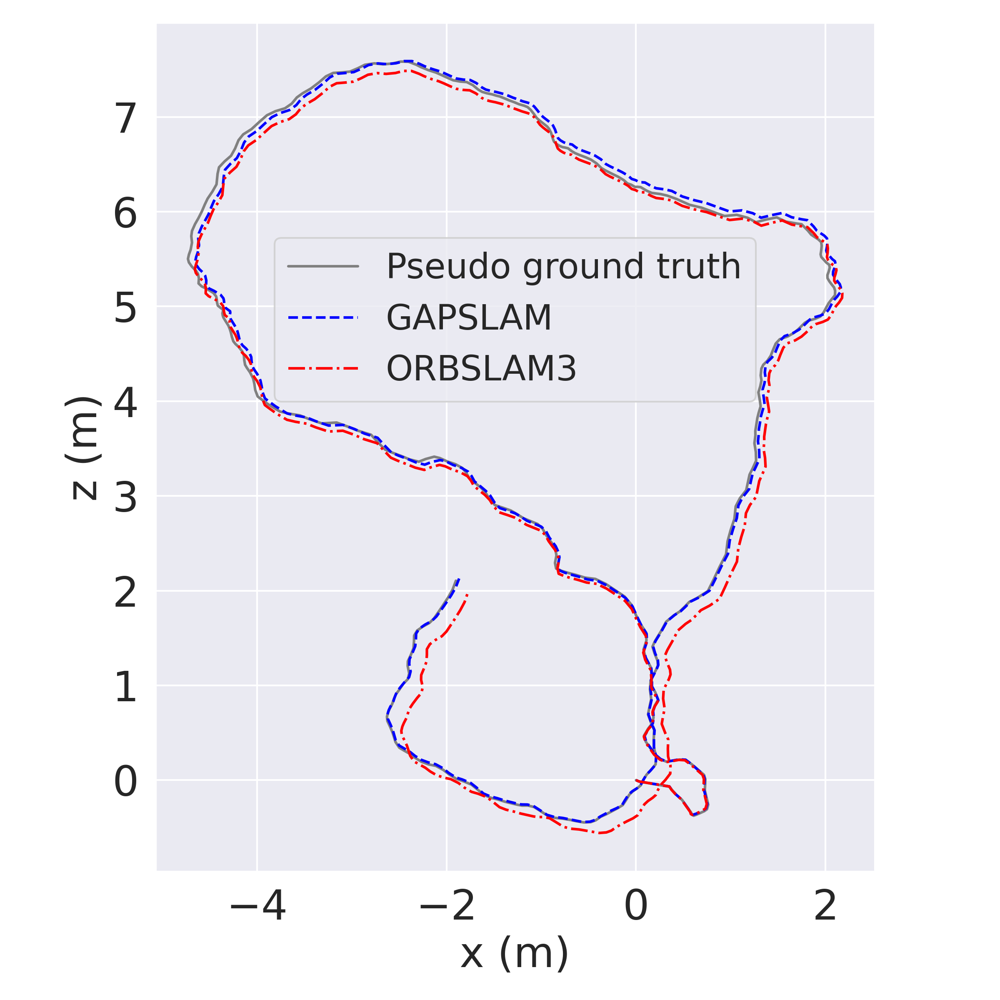
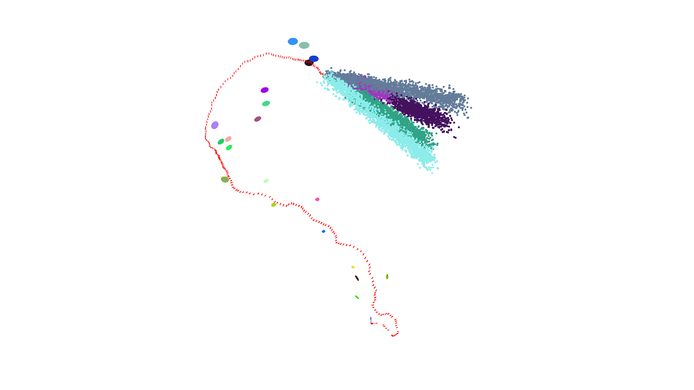

# GAPSLAM: Blending Gaussian Approximation and Particle Filters for Real-Time Non-Gaussian SLAM
This is the codebase for the GAPSLAM paper. This work aims to infer marginal posteriors of robot poses and landmark locations encountered in SLAM via real-time operation. [Paper](https://arxiv.org/pdf/2303.14283.pdf)

## Citation
```bibtex
@article{huang2023gapslam,
  title={{GAPSLAM}: Blending {G}aussian Approximation and Particle Filters for Real-Time Non-{G}aussian {SLAM}},
  author={Qiangqiang Huang and John J. Leonard},
  journal={arXiv preprint arXiv:2303.14283},
  year={2023}
}
```

## Approach


Illustration of our method: (a) a SLAM example, where the robot moves along poses in
green and makes measurements to landmarks in red, and (b) our method,
which blends Gaussain approximation in yellow and particle filters in pink.
The Gaussian approximation, centered on the maximum a posteriori (MAP)
estimate, provides robot pose distributions on which the particle filters are
conditioned to draw samples that represent landmark distributions. If a
sample attains a higher probability than the MAP estimate when evaluating
the posterior, landmarks in the Gaussian solver will be re-initialized by that
sample.


We provide the code and examples about the algorithms described in the paper. A teaser video about the work:

## Teaser video


https://github.com/doublestrong/gapslam/assets/5796120/0ce84ab4-0440-4502-8dba-fbdec63b9036


The following instruction was tested on Ubuntu 20.04.

Table of Contents
=================

* [GAPSLAM: Blending Gaussian Approximation and Particle Filters for Real-Time Non-Gaussian SLAM](#gapslam-blending-gaussian-approximation-and-particle-filters-for-real-time-non-gaussian-slam)
   * [Requirements on Ubuntu](#requirements-on-ubuntu)
   * [Installation](#installation)
   * [Examples](#examples)
      * [Range-only SLAM](#range-only-slam)
      * [Object-based bearing-only SLAM](#object-based-bearing-only-slam)

<!-- Created by https://github.com/ekalinin/github-markdown-toc -->

## Requirements on Ubuntu
```console
sudo apt-get install gcc libc6-dev
sudo apt-get install gfortran libgfortran3
sudo apt-get install libsuitesparse-dev
```

## Installation
```console
git clone git@github.com:doublestrong/GAPSLAM.git
cd GAPSLAM
conda env create -f env.yaml
conda activate gapslam
pip install -r requirements.txt
python setup.py install
```

## Examples
We provide examples for range-only SLAM and object-based bearing-only SLAM. In the range-only SLAM example, we compare GAPSLAM with other methods that also aim at full posterior inference. In the object-based SLAM example, we demonstrate that GAPSLAM can be scaled to 3D SLAM and generalized to other types of measurements (e.g., bearing-only).

### Range-only SLAM
We provide a few scripts in the following directory to run the range-only SLAM experiment. All results will be saved in the file folder `RangeOnlyDataset`.
```console
cd example/slam/rangeOnlySLAM
```
If you just want the final estimate of the robot path and landmark positions,
```console
python run_gapslam.py
```
and then, in `RangeOnlyDataset/Plaza1EFG/batch_gap1`, you can find



If you want to see how posteriors of robot poses and landmark positions evolve,
```console
python run_gapslam_visual.py
```
and then, in `RangeOnlyDataset/Plaza1EFG/gap1`, you can find



Methods for comparison:
1. RBPF-SOG, which is our implementation of algorithms in [this paper](https://ieeexplore.ieee.org/document/4650650)
    ```console
    python run_sog_rbpf.py
    python run_sog_rbpf_visual.py
    ```

2. NSFG, which is our implementation of algorithms in [this paper](https://ieeexplore.ieee.org/document/9826372)

    ```console
    python run_nsfg.py
    ```

### Object-based bearing-only SLAM
We provide you with [some data](https://drive.google.com/file/d/1QRsYgt7w4pVS7TcfbheTTK77YpM2N0sc/view?usp=share_link) of visual odometry and object detection to test our code. Unzip and extract the data to `example/slam/objectBasedSLAM/realworld_objslam_data`. If you just want the final estimate of the robot path and object locations,
```console
cd example/slam/objectBasedSLAM
python realworld_office_gapslam.py
```
and then, in `realworld_objslam_data/results/run0`, you can find 



If you want to get the visualization of posteriors of object locations,
```console
python realworld_office_gapslam_visual.py
```
and then in `realworld_objslam_data/results/run1` you can find visuals as follows:


