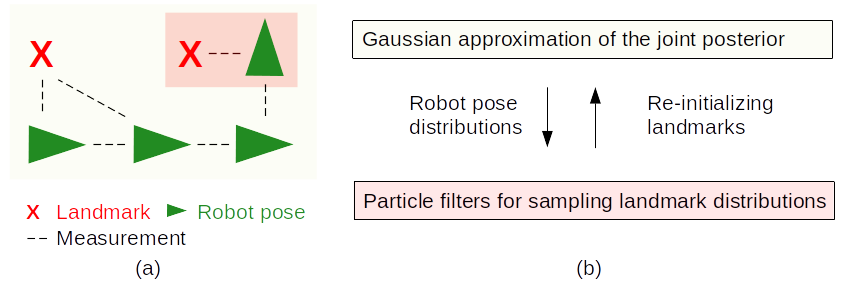

# GAPSLAM: Blending Gaussian Approximation and Particle Filters for Real-Time Non-Gaussian SLAM
This work aims to infer marginal posteriors of robot poses and landmark locations encountered in SLAM via real-time operation. [Paper](https://arxiv.org/pdf/2303.14283.pdf)

## Approach


Illustration of our method: (a) a SLAM example, where the robot moves along poses in
green and makes measurements to landmarks in red, and (b) our method,
which blends Gaussain approximation in yellow and particle filters in pink.
The Gaussian approximation, centered on the maximum a posteriori (MAP)
estimate, provides robot pose distributions on which the particle filters are
conditioned to draw samples that represent landmark distributions. If a
sample attains a higher probability than the MAP estimate when evaluating
the posterior, landmarks in the Gaussian solver will be re-initialized by that
sample.

## Teaser video

https://github.com/doublestrong/gapslam/assets/5796120/f03ed1ad-6e60-47dc-b4fb-53922a682f7d

## Code and examples
will be released soon.

## Citation
```bibtex
@article{huang2023gapslam,
  title={{GAPSLAM}: Blending {G}aussian Approximation and Particle Filters for Real-Time Non-{G}aussian {SLAM}},
  author={Qiangqiang Huang and John J. Leonard},
  journal={arXiv preprint arXiv:2303.14283},
  year={2023}
}
```
